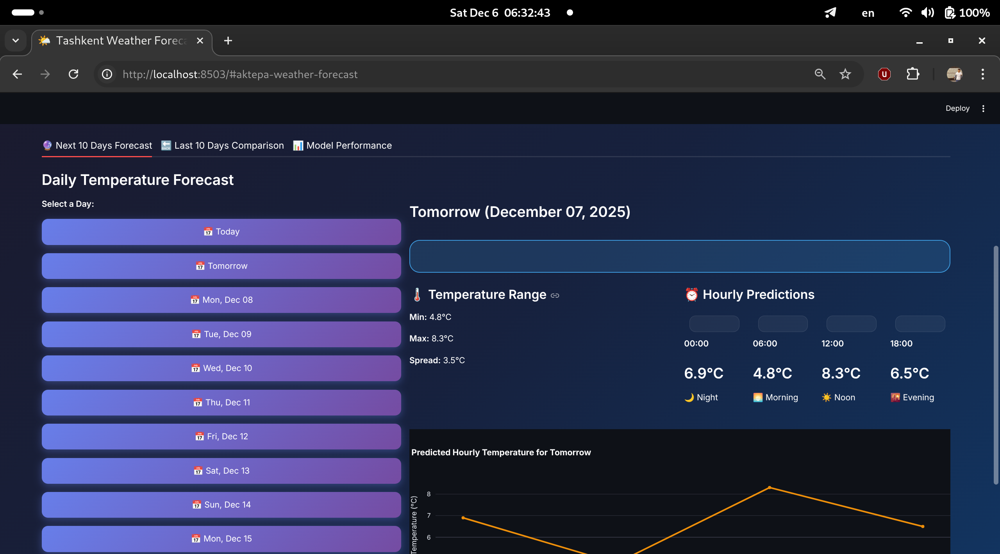

# Weather Forecast Model Ml For Tashkent

## Abstract
This repository contains a comprehensive weather prediction system for Tashkent, Uzbekistan, utilizing 23+ years of historical hourly weather data. The project implements and compares multiple machine learning approaches:

- Linear Regression - Baseline model with time-series features
- LSTM (PyTorch) - Deep learning model for sequential data

After extensive testing, Linear Regression showed superior performance and is used as the primary model in the demo application.

**Key Features**  

**23+ Years of Data: Historical hourly weather data from 2002 to present**
  
**Multiple Predictions: Temperature, humidity, wind speed, pressure, and rain probability**

**Interactive Dashboard: Beautiful Streamlit web interface**   
Dual Versions:
- Tashkent-specific model (this version)
- All Uzbekistan cities (see Uzbekistan_weather_forecast folder)

[Demo MP4](./vd/Tashkent.mp4)

## Installation

**Clone the repository**
```bash
git clone https://github.com/ShakhzodMirmuminov/Weather_predection_model.git

cd Weather_prediction_model
```
## Install dependencies

```bash
pip install -r requirements.txt
```
## Create a `.env` file based on `.env.example`:
```bash
   cp .env.example .env
```
## Add your OpenWeatherMap API key to `.env`:
```bash
   OPENWEATHER_API_KEY=your_api_key_here
```
## Collect historical data
Run the data collection script to fetch and update weather data:
```bash
python3 data_miner.py 
```
## Launch the application
```bash 
streamlit run streamlit_app.py
```
## Output

##  Model Performance
**Linear Regression Model (Primary)
Test Set Performance (Last 20% of data):**

RMSE: 1.245°C  
MAE: 0.42°C  
R² Score: 0.9847


**LSTM Model (PyTorch)  
Test Set Performance:**

 RMSE: 1.380°C   
 MAE: 1.077°C   
 R² Score: 0.9874

 ##  Contributing
Contributions are welcome! If you'd like to improve the rain prediction model or add new features.

`Thank You` 